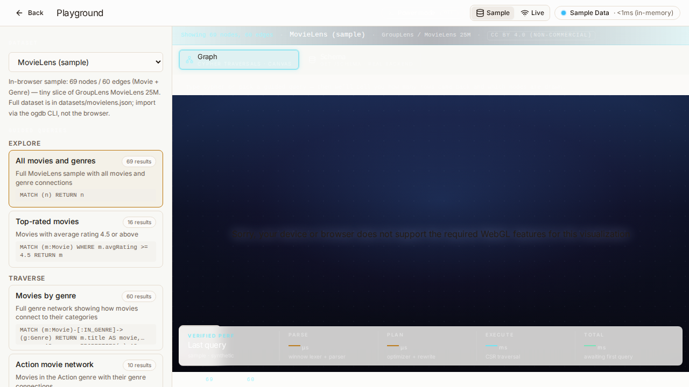

<div align="center">
  <a href="https://github.com/asheshgoplani/opengraphdb">
    
  </a>

  <p><strong>An open-source graph database that runs as a single file. Apache&nbsp;2.0.</strong></p>

  <p>
    <a href="https://github.com/asheshgoplani/opengraphdb/actions/workflows/ci.yml"></a>
    <a href="https://github.com/asheshgoplani/opengraphdb/releases"></a>
    <a href="LICENSE"></a>
  </p>

  
</div>

---

## What is it?

OpenGraphDB is an open-source graph database that runs as a single file. You can store nodes and edges (the way Neo4j does), search them with the Cypher query language, do fast vector search for AI and retrieval workloads, and load RDF/Turtle data. Apache 2.0.

## When to pick OpenGraphDB

- **Single binary, no Java needed.** One file you download. No separate server to install, no service to babysit.
- **AI-first.** Built-in agent integration so Claude, Cursor, and other coding assistants can query your graph directly.
- **Embeds in your app.** Drop it into a Rust, Python, or Node project as a library — or run it as a server. Same engine either way.

## Quickstart (5 minutes)

For the longer step-by-step walkthrough, see [`documentation/QUICKSTART.md`](documentation/QUICKSTART.md).

### 1. Install

```bash
curl -fsSL https://github.com/asheshgoplani/opengraphdb/releases/latest/download/install.sh | sh
```

This drops the `ogdb` binary at `~/.local/bin/ogdb` and creates a fresh empty database at `~/.ogdb/demo.ogdb`. Run `ogdb demo` afterward to load the MovieLens dataset and open the playground in your browser.

### 2. Wire your AI agent

```bash
ogdb init --agent --agent-id claude   # or: --agent-id cursor / aider / goose / continue / codex; omit --agent-id to auto-detect
```

Now Claude (or your coding agent of choice) can query the graph directly from your conversations.

### 3. Try a query

```bash
ogdb query ~/.ogdb/demo.ogdb \
  "MATCH (p:Person)-[:ACTED_IN]->(m:Movie) RETURN p.name, m.title LIMIT 5"
```

You should see five people and the movies they acted in. That's it — you have a working graph database.

## Can I use RDF data?

Yes. OpenGraphDB imports Turtle (`.ttl`), N-Triples, RDF/XML, JSON-LD, and N-Quads.

```bash
ogdb import data.ttl
```

The triples are loaded as nodes and edges and become queryable with Cypher right away. No separate triplestore, no extra setup.

## Going deeper

Once the basics make sense, here's where the rest lives:

- [`documentation/QUICKSTART.md`](documentation/QUICKSTART.md) — the longer five-minute walkthrough with sample data.
- [`documentation/COOKBOOK.md`](documentation/COOKBOOK.md) — runnable recipes for AI agents, hybrid retrieval, doc-to-graph ingestion, and time-travel queries.
- [`documentation/BENCHMARKS.md`](documentation/BENCHMARKS.md) — head-to-head numbers against Neo4j, Memgraph, and KuzuDB. We publish wins and losses both.
- [`documentation/MIGRATION-FROM-NEO4J.md`](documentation/MIGRATION-FROM-NEO4J.md) — coming from Neo4j? Cypher-by-Cypher mapping and driver compatibility notes.
- [`ARCHITECTURE.md`](ARCHITECTURE.md) — storage layout, transactions, recovery.
- [`SPEC.md`](SPEC.md) — the product and interface specification.
- [`DESIGN.md`](DESIGN.md) — the 18-crate workspace map.

### What's inside

OpenGraphDB ships with the Cypher query language, vector search for AI and retrieval workloads, full-text search, RDF import/export, snapshot transactions with crash recovery, and an embedded web playground served from the same binary. Embed it as a Rust crate (`ogdb-core`), call it from Python or Node, or run `ogdb serve --http` for a server with HTTP and an embedded UI on port 8080.

### Roadmap

Tracked under [Issues](https://github.com/asheshgoplani/opengraphdb/issues) and [Discussions](https://github.com/asheshgoplani/opengraphdb/discussions). Near-term: faster bulk loading, multi-writer access, richer Python and Node bindings, larger-scale benchmark numbers, and a gRPC transport.

## Contributing

OpenGraphDB is greenfield and contributor-friendly. Storage engines, query optimization, vector search, RDF tooling, agent integrations, and developer experience are all open lanes. See [`CONTRIBUTING.md`](CONTRIBUTING.md) for the test-first workflow.

→ [Issues](https://github.com/asheshgoplani/opengraphdb/issues) · [Discussions](https://github.com/asheshgoplani/opengraphdb/discussions) · [Code of Conduct](CODE_OF_CONDUCT.md) · [Security policy](SECURITY.md)

## License & Acknowledgements

OpenGraphDB is licensed under [Apache 2.0](LICENSE).

Built on the work of: [Tantivy](https://github.com/quickwit-oss/tantivy), [`instant-distance`](https://github.com/InstantDomain/instant-distance), [Roaring bitmaps](https://roaringbitmap.org/), the [openCypher](https://opencypher.org/) project, and Neo4j's Cypher language design.
